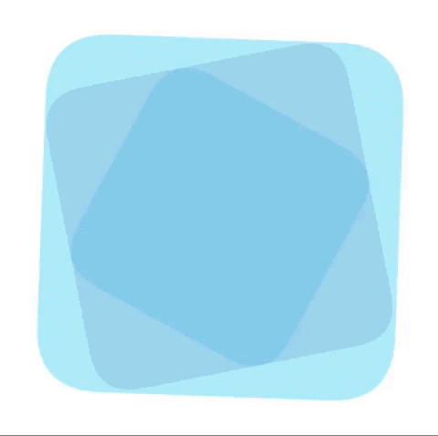
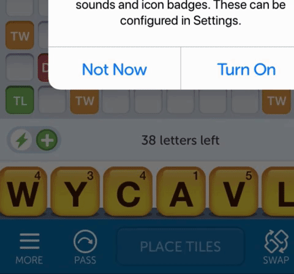

# elCanvas
A lightweight library to support basic canvas shape drawing while having an object list you can control!

Filesize of minified library: **14kb**

Feel fee to post feedback and improvement suggestions, pull, modify as you wish :)

Examples of pure canvas animation:

(Check out the tests folder and examples folder for more examples)

I've been trying to push how much I can animate in very little filesize for a long time, and while DOM and SVGs are pretty good i never could get the same performance results as when I was animating in a canvas context. So I built this mini library so that I can have a sudo object system where you animate your objects e.g. var mycircle = new el.circle() and on update() it updates the canvas context with its properties. It works with whatever animation tech you want as long as you feed into the loop the update() function.

I chose GSAP since I could directly feed the update refresher into a timeline like this
var myCanvasTimeline = new TimelineMax({onUpdate:el.update})

## Basics

### Quick Setup

declare  where the canvas goes(must be a canvas element)

    var canvas_container = document.getElementById('elCanvas');

create an instance

      this.el = new elCanvas(canvas_container);

create an object

    var myCoolRectangle = new el.rect()

call an udpate function to draw the frame

	this.el.update()

#### Optional, using GSAP(which you should have before this is loaded)
create a timeline, have the canvas update on update

    var tl = new TimelineMax({onUpdate: el.update})

    // link for interactive animation
    canvas_container.addEventListener('click',function(){ test_tl.play(0);});

 ## El properties
 You can optinally start elCanvas centered like so

   	this.el = new elCanvas(canvas_container,{AlignToCenter:true});

  You can also remove objects from the stage with .remove(my object or array of my objects) like so

  	this.el.remove(myCoolRectangle)

## Animation

You can animate the objects the same way you animate dom elements, using most of the same properties

      var tl = new TimelineMax({onUpdate: el.update})
      .to(myCoolRectangle,1,{x:500,ease:Expo.easeInOut,yoyo:true,repeat:-1})

Would animate this the same way you would animate it in dom
### Types of shapes
below are the currently suported shape types. Remember to create them with new el.type e.g.

`var myCircle = new el.circle({x:20, y:20, radius:50 ,style: {fillStyle'red'}});`

ID | Type
------------ | -------------
rect() | rectangle type
circle() | circle type, supports radius for size
text() | text type
image() | image type, image needs to be preloaded first, passed into ID e.g. {id:'test'}
ine() | basic line , uses x1,x2,y1,y2 e.g. pass in {x1:0, y1:0, x2: 100, y2: 100}
quadLine() | shorthand for quadLine e.g. pass in {x1:240,y1:240,qx:-50,qy:-50,x2:200,y2:150}
shape() | custom shape, pass in custom shape data, see below for example

Custom shape example parameters

        var shape = new el.shape({x:200,y:20});
        shape.customShape=function(){
          el.ctx.beginPath()
          .moveTo(0,17).lineTo(17,15).lineTo(24,0).lineTo(31,15).
          lineTo(48,17).lineTo(36,29).lineTo(39,45).lineTo(24,37).
          lineTo(9,45).lineTo(12,29).lineTo(1,17)
          .closePath()
        };

## Supported properties

These can be used in animation or in creation e.g.
`var myCircle = new el.circle({x:30,y:30})`
or
`TweenMax.to(myCircle,1,{x:20,y:100,rotation:30})`

Property | Support
------------ | -------------
x,y | yes
top, left | no
scale | yes
scaleX, ScaleY | yes (But only if NOT animating scale, and vice-versa)
rotation | yes
opacity | yes
skew | no
parent | yes(specifiy only another el object)
globalcompositeoperation | yes
transformOrigin | only percent values, width/height must be specified
zIndex | yes (Only on creation)
radius | yes, also takes individual sides e.g.,radius:{tl:20,tr:0,bl:2,br:40}

### Types of shapes
(please keep in mind the x and y positions are always optional)
##### Rectangle
    var rectangle = new el.rect()

##### Circle

    var circle = new el.circle({x:-90})

  ##### Text

    var mytext = new el.text({text:"good day eh"})

  ##### Line

    var line = new el.line({x1:140,y1:40,x2:100,y2:200})

  ##### QuadLine(see quadraticcurveto in the canvas mdn)

    var quadLine = new el.quadLine({x1:240,y1:240,qx:-50,qy:-50,x2:200,y2:150})

  ##### image

  images need to be preloaded into the images list as base64 for them to work

    var image = new el.image({id:'test'})

 ##### shape

    var shape = new el.shape({x:200,y:20})

  a custom shape must be specified otherwise you will get errors

        shape.customShape=function(){
              el.ctx.beginPath()
              .moveTo(0,17).lineTo(17,15).lineTo(24,0).lineTo(31,15).
              lineTo(48,17).lineTo(36,29).lineTo(39,45).lineTo(24,37).
              lineTo(9,45).lineTo(12,29).lineTo(1,17)
              .closePath()
          }
## Chaining

As you see by the above

    el.ctx.beginPath()
                  .moveTo(0,17).lineTo(17,15).lineTo(24,0).lineTo(31,15).
                  lineTo(48,17).lineTo(36,29).lineTo(39,45).lineTo(24,37).
                  lineTo(9,45).lineTo(12,29).lineTo(1,17)
                  .closePath()

ElCanvas supports chaining of canvas events to reduce code, so if you wish to draw something or trigger canvas events( el.ctx is the same as canvas.ctx) please keep in mind you can chain everything together like the above and heavily reduce code.

## Parenting

When you give a child a parent node it will react as if the parent is the world acess basis, it will rotate, and move based off it as well as if you move the parent the child will follow. Currently opacity isn't supported by parenting, but i'm working on making that work

example of parenting:

    var red_limb = new el.rect({transformOrigin:"100% 50%" ,y:300,width:300,x:-200,height:50,style:{fillStyle:'red'}})

    // create a child, linking it to the parent, it's word space is now based off the parent
    var blue_limb = new el.rect({parent:red_limb,width:50,height:200,style:{fillStyle:'blue'}})

    // create a timeline, have the canvas update on update
    var tl = new TimelineMax({onUpdate: el.update})
    // when the parent moves the child moves
    .to(red_limb,1,{rotation:90})

## Styling
ElCanvas takes the same styling properties as canvas itself, under the styles tab you can put as many as you'd like e.g.

	var myCoolText = new el.text({x:0,y:20, text:"hihi", style:{font:"65px museo700",  fillStyle:"#4C1900"}})

or premake the style and apply it like this

 	var bgStyle = {fillStyle'red',strokeStyle:'blue',lineWidth:10};
    var bg=new this.el.rect({width:90,height:90,,style:bgStyle});

## More on custom shapes

You can create a utility function(like we have in the game for prebuilt custom shapes, and then call them this way we can reuse code

such as

    new el_util_custom_shapes(this.el);

    var starShape = new el.shape({customShape:this.el.customShapes.starShape})

    var bannerShape = new el.shape({y:50,customShape:this.el.customShapes.banner_50})

## Other things to note
zIndex only gets checked once on the first update, so ideally it should be decalred on object declaration, if it's not it will just get created automatically based off draw order. So if you wish to change it mid animation use el.resetZIndex() , however I do not  recomend doing this as it is a taxing process if it's done over and over. Which is why I decided to only have it check innitially.

There is an object list at all times, so if you wish to check how many items there are on the stage at any time see el.objects which is an array of all objects on stage

## License

  El Canvas
  Copyright (C) 2019 Lucky Dee

  This is free and unencumbered software released into the public domain.

  Anyone is free to copy, modify, publish, use, compile, sell, or
  distribute this software, either in source code form or as a compiled
  binary, for any purpose, commercial or non-commercial, and by any
  means.

  In jurisdictions that recognize copyright laws, the author or authors
  of this software dedicate any and all copyright interest in the
  software to the public domain. We make this dedication for the benefit
  of the public at large and to the detriment of our heirs and
  successors. We intend this dedication to be an overt act of
  relinquishment in perpetuity of all present and future rights to this
  software under copyright law.

  THE SOFTWARE IS PROVIDED "AS IS", WITHOUT WARRANTY OF ANY KIND,
  EXPRESS OR IMPLIED, INCLUDING BUT NOT LIMITED TO THE WARRANTIES OF
  MERCHANTABILITY, FITNESS FOR A PARTICULAR PURPOSE AND NONINFRINGEMENT.
  IN NO EVENT SHALL THE AUTHORS BE LIABLE FOR ANY CLAIM, DAMAGES OR
  OTHER LIABILITY, WHETHER IN AN ACTION OF CONTRACT, TORT OR OTHERWISE,
  ARISING FROM, OUT OF OR IN CONNECTION WITH THE SOFTWARE OR THE USE OR
  OTHER DEALINGS IN THE SOFTWARE.

  For more information, please refer to <http://unlicense.org>
